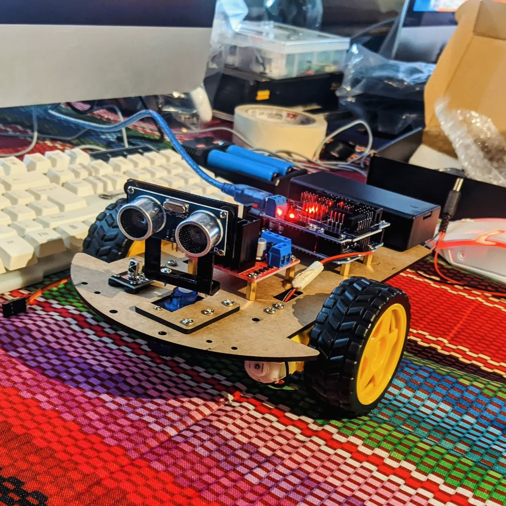

# Robotics Curriculum

## Week 1: Assembly & Orientation

* **Day 1:** Build the chassis. Identify each part and what it does.
* **Day 2:** Finish building. Power test. Upload a “blink” to confirm wiring works.

---

## Week 2: Arduino Fundamentals

- **Day 1 (Code):** Intro to C. Serial basics: `Serial.print()`, Hello World, debugging. Digital output with LED blink patterns.
- **Day 2 (Robot):** Video presentation + lecture on robotics funamentals

  - [An Introduction To Robotics 🤖 By Teach Kids Robotics](https://www.youtube.com/watch?v=HvMQONnCXbE)
  - [Valkyrie: NASA's Superhero Robot](https://www.youtube.com/watch?v=IE-YBaYjbqY)

---

## Week 3: Head Games

- **Day 1:** How servo motors work
  - [Controlling Self Driving Cars](https://youtu.be/4Y7zG48uHRo)
- **Day 2:** Ultrasonic sensors
  - [Ultrasonic Sensor Module](https://youtu.be/KGwtit2bFyo)

---

## Week 4: Motors & Remote Control

- **Day 1:** Read IR remote signals using a library. Print codes to Serial Monitor. Learn about Motor drivers.
  - [How DC GEAR MOTOR Works with ARDUINO and L298N](https://youtu.be/GPVC84D5ULw)
  - [IR Remote with Arduino Uno](https://youtu.be/q97VE3oEwIc)
- **Day 2:** Remote control mode: UP = forward, DOWN = backward, LEFT = spin left, RIGHT = spin right. (Reward = they can drive their robot like an RC car).

---

## Week 5: Raspberry Pi & the separation for decision making from control modules

- **Day 1:** Getting comfortable with what raspberry pi is, and setting up our control interfaces
- **Day 2:** decision making vs control modules

---

## Week 6: Obstacle Avoidance and world mapping

- **Day 1 (Code):** What is obstacle avoidance and world mapping?
  - 
- **Day 2 (Robot):** Robot avoids collisions: if wall < 20cm, stop and turn. Teach **autonomy = decision-making**.

# Capstone Project Week (Optional Week 9 if time allows)

- Teams design **autonomous robot demos**:
  - Maze-solving.
  - Obstacle race.
  - “Robot dance battle” (sync servo sweeps & motion).
  - Remote-vs-autonomous switch mode.
- Students present their robots, explain their code, and show creativity.

---

# Learning Outcomes

By the end, each student can:

- Assemble and wire a robot from scratch.
- Use **Arduino libraries** (Servo, IRremote, etc.).
- Write modular functions (`forward()`, `scanLeft()`, etc.).
- Implement **sensor-based autonomy** with ultrasonic + servo scanning.
- Debug and troubleshoot using Serial Monitor.
- Create a final project that’s personal and rewarding.

---

To keep it **rewarding**:

- Every session ends with something **moving or visual** (LED blink, wheel spin, sensor print, robot turning).
- Students **see the robot get smarter** each week: from blinking → moving → controlled → sensing → thinking.

---

# Resources

[https://docs.arduino.cc/](https://docs.arduino.cc/)
